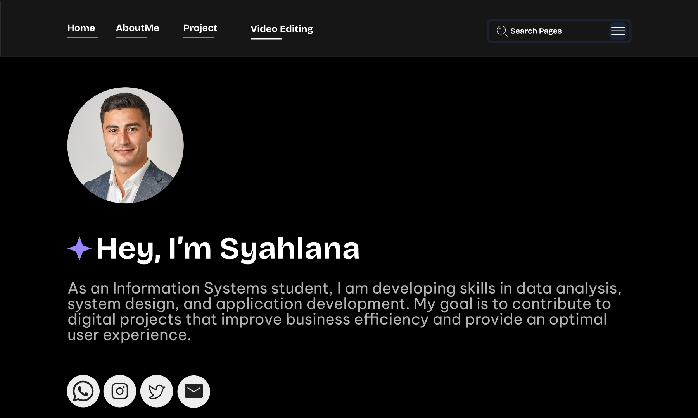
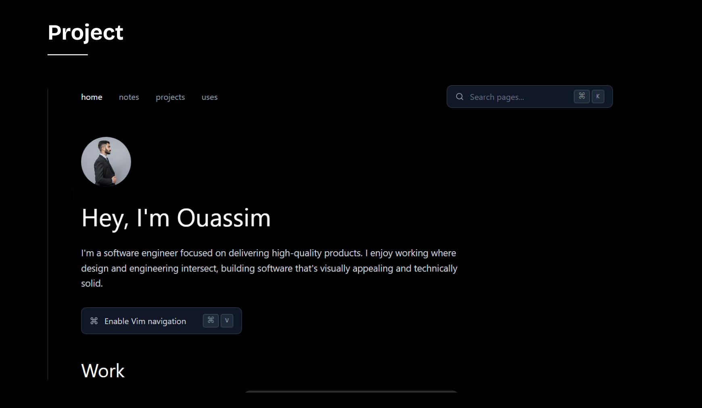

# Personal Website

This is my personal website where I showcase my portfolio and blog about web development.

## Links

- [My Portofolio](https://www.figma.com/proto/7OmPXB3dcAKQdsJNBS9q4R/Untitled?node-id=1-2&t=V8PIPE1cssCDc0SD-1)

## Social Media

- [GitHub](https://github.com)
- [LinkedIn](https://linkedin.com)
- etc...

## Pages

- Home
- Project
- Editing Video

## Home

"I believe technology can help solve everyday problems. As an
Information Systems student at MH Thamrin University, I am interested
in data analysis, web development, and information systems management.
I have problem-solving skills and enjoy collaborating to create
innovative solutions."

## Project

Some of the projects I have recently created include a calculator application for Android, a game top-up website, and an application for storing student data.

## Contact

- [GitHub](https://github.com)
- [LinkedIn](https://linkedin.com)
- [email] (izharhalqi777@gmail.com)

## Technologies Used

- HTML
- CSS
- JavaScript
- sql

## Preview

### Home

- 

### aboutMe

- 

### Project

- 

### Project2

- 

### Contact

- 
